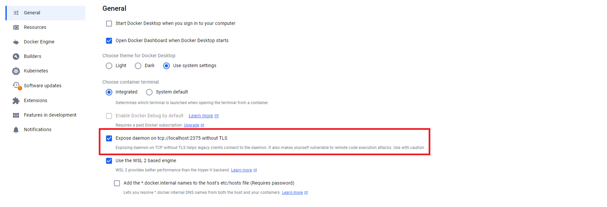

# Goraebab

## Table of Contents
[Introduce](#introduce)
- [Problem](#problem)
- [Solution](#solution)

  
[Architecture](#architecture)
- [Tech](#tech)


[How to run Goraebab](#how-to-run-goraebab)
- [Requirements](#requirements)
- [Execution](#execution)

[How to use Goraebab](#how-to-use-goraebab)

[API documentation](#api-documentation)

[How to contribute](#how-to-contribute)

[Upcoming features](#upcoming-features)

[Contributors](#contributors)


# Introduce

## Problem
With the advancement of AI, the barriers to software development have significantly lowered. As a result, beginner developers can save considerable time in the implementation phase, and most projects now reach the deployment stage. In the deployment process, Docker has become an almost essential tool. However, for novice developers, managing containers, networks, and volumes through the Docker CLI can be quite challenging. In a survey conducted among developers, ??% of respondents expressed difficulties and frustrations related to the complexity of managing containers, networks, and volumes.

[차트 이미지]

## Solution

Goraebab addresses this issue by enabling users to design Docker configurations visually in a GUI environment. Instead of manually managing containers, networks, and volumes through the CLI, developers can create, modify, and deploy entire Docker architectures through an intuitive, drag-and-drop interface. In addition, Goraebab provides educational tips and explanations about Docker, allowing beginners to learn while they develop. This approach simplifies complex configurations, reduces errors, speeds up the deployment process, and helps novice developers gain confidence with Docker concepts.


# Architecture

## Tech

### Frontend

   

### Backend
        


# How to run Goraebab

**Note**: The `develop` or `main` branch  may be in an *unstable or even broken state* during development. Please use `release-*`  in order to get a stable versions.


## Requirements

### Hardware

Recommended Resources
- CPU - 6 cores, 12 threads
- RAM - 16 GB
- Monitor resolution - 1470 x 956


### Software

OS
- Window 10 or higher
- macOS 14(Sonoma) or higher
- Linux ubnutu 20.04 or higher


1. Install Docker and Docker-compose.

2. Run docker daemon for external access. This tool uses HTTP communication between Dockers, so please note that **it does not guarantee security.**

    - Windows

      

    - Linux (Ubuntu)
      
      [Docker docs about Linux Setting](https://docs.docker.com/engine/daemon/remote-access/)


      ```bash
      sudo systemctl edit docker.service
      
      [Service]
      ExecStart=
      ExecStart=/usr/bin/dockerd -H fd:// -H tcp://0.0.0.0:2375
      ```

    - macOS
  
      ```bash
      brew install socat
      socat TCP-LISTEN:2375,reuseaddr,fork UNIX-CLIENT:/var/run/docker.sock
      ```

      
3. Secure Docker and Host Connection with TLS
   
   [Docker docs about TLS settings](https://docs.docker.com/engine/security/protect-access/)
   
   It is highly recommended to use this tool with TLS configuration if it is intended for production development rather than simple learning or testing purposes. For a more secure connection between Docker and the host, it’s recommended to configure TLS (Transport Layer Security). TLS encrypts the data transmitted between Docker clients and the Docker daemon, ensuring that sensitive information and commands remain confidential and tamper-proof. By using TLS, you also authenticate both the client and server, which allows only verified users and applications to interact with Docker.
  


## Execution

```bash
# Check if port 2387, DBMS DEAFULT port is available

git clone https://github.com/Team-Goraebab/Goraebab.git


# This tool support MySQL, Mariadb, Postgresql, Oracle

# Mac or Linux
chmod +x start.sh
./start.sh {DBMS name}  

# or

# Windows
./start.bat {DBMS name} 

```


# How to use Goraebab

## Pull image

## Create network

## Create volume

## Connect Remote Docker

## Draw blueprint

## Load & Save blueprint

# API documentation

You can check the API specification through `localhost:2387/swagger`.

# How to contribute

# Upcoming features

- More intuitive, beginner-friendly UI
- Flexible option settings (ex. port)
- Distinguish volume connections in the UI

# Contributors
[](https://github.com/Team-Goraebab/Goraebab/graphs/contributors)

# License
Goraeabab is licensed under the **Apache 2.0 License**. See the [LICENSE](LICENSE) file for details.

