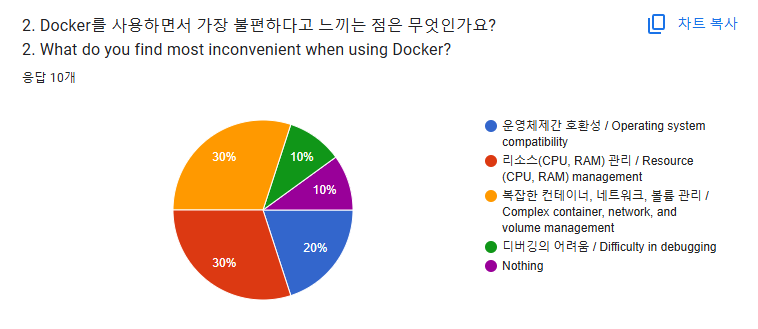

# Goraebab


## Table of Contents
[Introduce](#introduce)
- [Problem](#problem)
- [Solution](#solution)

  
[Architecture](#architecture)
- [Tech](#tech)


[How to run Goraebab](#how-to-run-goraebab)
- [Requirements](#requirements)
- [Execution](#execution)

[How to use Goraebab](#how-to-use-goraebab)
- [Pull image](#pull-image)
- [Create network](#create-network)
- [Create volume](#create-volume)
- [Create host](#create-host)
- [Draw blueprint](#draw-blueprint)
- [Load & Save blueprint](#load-&-save-blueprint)

[API documentation](#api-documentation)

[How to contribute](#how-to-contribute)

[Upcoming features](#upcoming-features)

[Contributors](#contributors)


&nbsp;


# Introduce

## Problem
With the advancement of AI, the barriers to software development have significantly lowered. As a result, beginner developers can save considerable time in the implementation phase, and most projects now reach the deployment stage. In the deployment process, Docker has become an almost essential tool. However, for novice developers, managing containers, networks, and volumes through the Docker CLI can be quite challenging. In a survey conducted among developers, ??% of respondents expressed difficulties and frustrations related to the complexity of managing containers, networks, and volumes.



## Solution

Goraebab addresses this issue by enabling users to design Docker configurations visually in a GUI environment. Instead of manually managing containers, networks, and volumes through the CLI, developers can create, modify, and deploy entire Docker architectures through an intuitive, drag-and-drop interface. In addition, Goraebab provides educational tips and explanations about Docker, allowing beginners to learn while they develop. This approach simplifies complex configurations, reduces errors, speeds up the deployment process, and helps novice developers gain confidence with Docker concepts.

&nbsp;

# Architecture

## Tech

### Frontend

   

### Backend
        


## System Architecture
<p align="center">
  
</p>

&nbsp;


# How to run Goraebab

**Note**: The `develop` or `main` branch  may be in an *unstable or even broken state* during development. Please use `release-*`  in order to get a stable versions.


## Requirements

### Hardware

Recommended Resources
- CPU - 6 cores, 12 threads
- RAM - 16 GB
- Monitor resolution - 1470 x 956

&nbsp;

### Software

OS
- Window 10 or higher
- macOS 14(Sonoma) or higher
- Linux ubnutu 20.04 or higher


1. Install Docker and Docker-compose.

2. Run docker daemon for external access. This tool uses HTTP communication between Dockers, so please note that **it does not guarantee security.**

    - Windows

      

    - Linux (Ubuntu)
      
      [Docker docs about Linux Setting](https://docs.docker.com/engine/daemon/remote-access/)


      ```bash
      sudo systemctl edit docker.service
      
      [Service]
      ExecStart=
      ExecStart=/usr/bin/dockerd -H fd:// -H tcp://0.0.0.0:2375
      ```

    - macOS
  
      ```bash
      brew install socat
      socat TCP-LISTEN:2375,reuseaddr,fork UNIX-CLIENT:/var/run/docker.sock
      ```

      
3. Secure Docker and Host Connection with TLS
   
   [Docker docs about TLS settings](https://docs.docker.com/engine/security/protect-access/)
   
   It is highly recommended to use this tool with TLS configuration if it is intended for production development rather than simple learning or testing purposes. For a more secure connection between Docker and the host, it’s recommended to configure TLS (Transport Layer Security). TLS encrypts the data transmitted between Docker clients and the Docker daemon, ensuring that sensitive information and commands remain confidential and tamper-proof. By using TLS, you also authenticate both the client and server, which allows only verified users and applications to interact with Docker.
  
## Execution

```bash
# Check if port 2387, DBMS DEAFULT port is available

git clone https://github.com/Team-Goraebab/Goraebab.git


# This tool support MySQL, Mariadb, Postgresql, Oracle

# Mac or Linux
chmod +x start.sh
./start.sh {DBMS name}  

# or

# Windows
./start.bat {DBMS name} 

```


&nbsp;


# How to use Goraebab

## Pull image
To add an image, click the "Image" button in the left sidebar, then click the "+ Image" button in the right sidebar. For image addition, the Docker engine must be connected, indicated by a green connected status icon in the bottom bar if the connection is active. Images can be imported from your local computer or Docker Hub, with options to specify the image name and tag.   
When retrieving images from Docker Hub, you can search for the desired image and select it; each image shows download counts, providing a measure of reliability. When importing from your local computer, you can either drag and drop the file or select a file path. The right sidebar displays the list of images you’ve added, and by clicking the toggle button, you can view detailed information for each image.   


## Create network
Click the "Network" button in the left sidebar, then press the "+ Custom Bridge" button in the right sidebar to create a network. You can set the network's name, subnet, gateway, and mode. You can also view the network's detailed information by clicking the "Network Info" button or using the toggle button. To link a host to the network, click the desired host and then press the link button to complete the connection. The connected host will be highlighted with a blue border.


## Create volume
Click the "Volume" button in the left sidebar, then click the "+ Volume" button in the right sidebar to create a volume. When creating a volume, you can specify the volume's name, mount point, capacity, and type (e.g., Local, NFS, GlusterFS, Ceph). After creating the volume, click the "Volume Info" button or the toggle button to view detailed information about the volume.


## Create host
By clicking the "Home" button in the bottom bar, you can create a host. When creating a host, you can set the host's name, type (local or remote), and the network to be connected. After creating the host, click the "Settings" button to configure the network, ports, mounts, environment variables, and commands. By clicking the "Edit" button, you can set the container name, and in the images tab, you can drag an image from the left sidebar to select the image to use for the container. By clicking the "Plus" button, you can connect a volume, and you can view the connected volumes by pressing the toggle button.


## Load & Save blueprint
Click the "Blueprint List" button in the bottom bar to view all saved blueprints. The list shows each blueprint's name, creation date, and whether it is local or remote, and you can load or delete blueprints from this view. To save a new blueprint after creating it, click the "Save Blueprint" button in the bottom bar. Once saved, a container will be created and run in the Docker environment based on the blueprint settings. You can view the running container by clicking the "Container" button in the left sidebar.


# API documentation

You can check the API specification through `localhost:2387/swagger`.

# How to contribute


# Upcoming features

- More intuitive, beginner-friendly UI
- Flexible option settings (ex. port)
- Distinguish volume connections in the UI

# Contributors
[](https://github.com/Team-Goraebab/Goraebab/graphs/contributors)

# License
Goraeabab is licensed under the **Apache 2.0 License**. See the [LICENSE](LICENSE) file for details.

